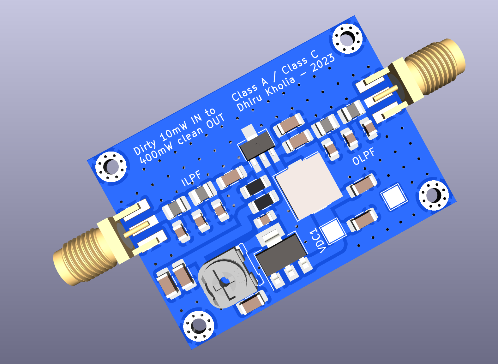

This PCB was validated in July, 2023.

It outputs around 210mW into a dummy load @ 28 MHz even without any matching at
the output side. This is more than enough to drive RD16HHF1-501 easily.

Input is ~10mW straight from a Si5351 clone module.

We should probably add some simple LC matching at the output side one day.

Measurements on tinySA after 50 dB attentuation:

```
-24.4 dBm - Fc

-71.9 dBm -> second harmonic

dBc = ~47
```
